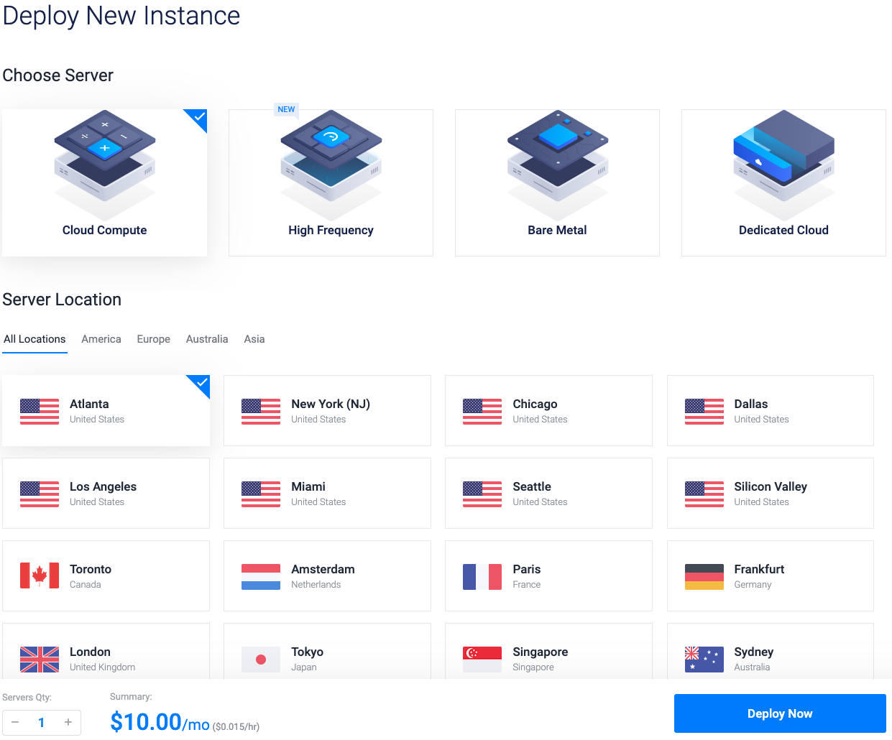
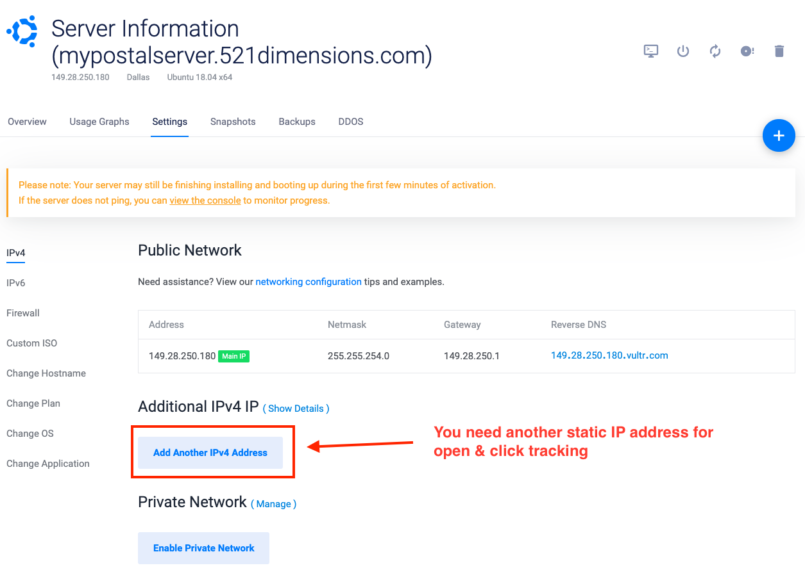
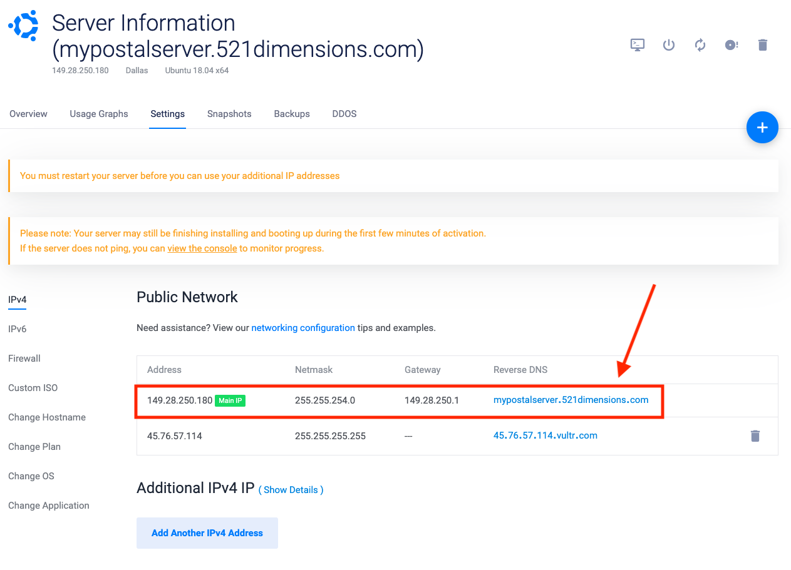
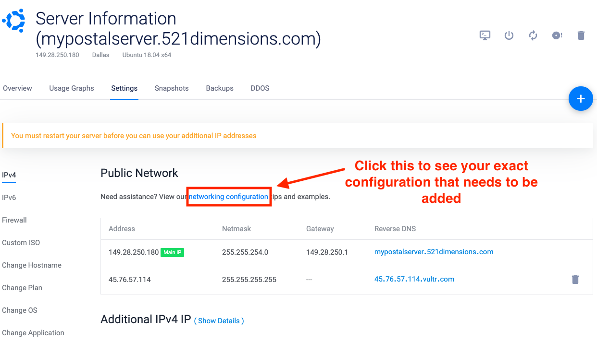
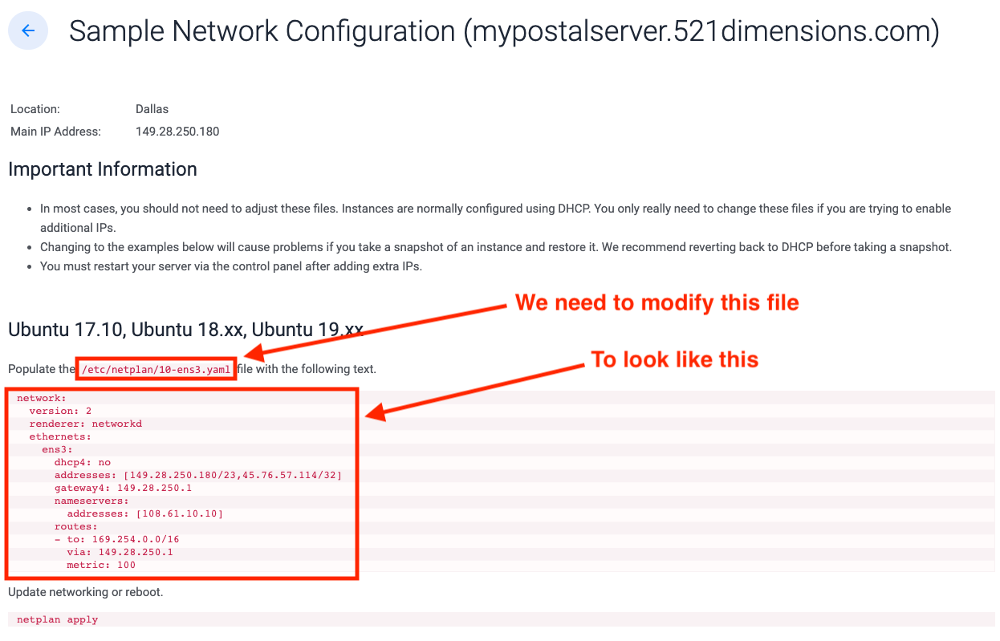

<p align="center">
		
</p>
<p align="center">
    <a href="https://raw.githubusercontent.com/521dimensions/ansible-postal/master/LICENSE" target="_blank"></a>
    <a href="https://www.paypal.me/521dimensions/20usd"></a>
    <p align="left">Deploy a fully functional and secure <a href="https://postal.atech.media/">Postal server</a> in minutes. If you found this valuable, <a href="https://www.paypal.me/521dimensions/20usd">please donate</a> so we can continue to bring the world open source resources.</p>
</p>

# Overview
This is an example of an Ansible repository that will automatically deploy Postal SMTP server and secure it for you. It does require a little background in server administration and how Ansible works.

This entire setup supports the following features and **deploys everything for you in less than 6 minutes (even on slower servers)**:
* 🚀 Automatic installation & configuration of [Postal](https://postal.atech.media/)
* 😱 Automatic configuration of HTTPS & TLS for secure emails & web GUI Access (via Let's Encrypt)
* 🔐 Secure server management with hardened SSH (passwordless, disabled root login, and custom SSH ports)
* ⏫ Automatic server security updates (Postal updates are still manual though...)


### What is Ansible?
Ansible is a tool that you install on your computer that will connect to your server over SSH and configure it for you. If you are not familiar with Ansible, we highly suggest that you read [Ansible's Getting Started Guide](https://docs.ansible.com/ansible/latest/user_guide/intro_getting_started.html). This will help you understand the most important concepts and how to install it on your local machine.


# 🚨 Special Notes
This code has been running in production and has been running well for us. Few important notes for you to understand:

* It has been tested on **Ubuntu 18.04 only**
* We see improvements how this repository could be organized better, but it is the first release and we just wanted to focus on getting the code out there for people to reference

# Preparing your server
The remainder of this document will walk you through how to deploy and configure your Postal server.
## Choose your Cloud Provider

### System requirements
* At least 2GB of RAM (for the smallest Postal instances)
* **TWO** Static public facing IP addresses (if you plan to use [Click & Open Tracking](https://github.com/atech/postal/wiki/Click-&-Open-Tracking))
* We've only tested this Ansible deployment with **Ubuntu 18.04**

### Recommended providers
* [Vultr](https://www.vultr.com/?ref=7093917) (recommended if you want "Click & Open Tracking")
* [Digital Ocean](https://m.do.co/c/f3bad4b927ca)
* [Linode](https://www.linode.com/?r=5a1b585e4eb919d3d89ad242bd1bb2924754c444)

DISCLAIMER: The above links are affiliate links. This kicks back a few bucks to us for the referral, but does not cost you *anything* extra to you. Affiliate programs do not influence our recommendations in any sort of way either. These are the best recommendations available.

**🚨Important note:** Since we do use Click & Open tracking, we found [Vultr](https://www.vultr.com/?ref=7093917) to have the easiest support for a second Internet IP address. We have had issues with Digital Ocean's "floating IP address" before, so that's why we went with Vultr. The rest of this guide will show you how to deploy through [Vultr](https://www.vultr.com/?ref=7093917).

## Configure your SSH keys
For best security, make sure your SSH keys are configured and [added to your Vultr account](https://www.vultr.com/docs/how-do-i-generate-ssh-keys).

## Deploy an Ubuntu 18.04 server
You can get a simple Postal server through [Vultr](https://www.vultr.com/?ref=7093917) for as little as $10/mo.

Be sure to select/configure:
* Any region that you want
* Ubuntu 18.04 x64
* A server with at least 2GB of memory
* Your SSH key [that you have added to your account](https://www.vultr.com/docs/how-do-i-generate-ssh-keys)
* A proper DNS name for your server (our example is `mypostalserver.521dimensions.com`)



## Add your "A record" for your server to your DNS
Our example is `mypostalserver.521dimensions.com`, so we added an "A record" that points to our IP address that Vultr gave us.

## Add your secondary IP address (if you plan to use Click & Open Tracking)
Going back to the Vultr portal, go to "Settings &rarr; IPv4" then click "Add Another IPv4 Address".



## ⚠️ VERY IMPORTANT: Configure the Reverse DNS for your "Main IP"
Now you should have two IP addresses, but we need to configure the reverse DNS to point to the same DNS record that you added above for your server (our example of `mypostalserver.521dimensions.com`). Without this step, your email will fail to deliver.



## View your networking configuration
Although the secondary IP address has been added to your account, you need to configure your server. Click on the "networking configuration" link to see your exact configuration that you will need to add.



## Apply your secondary network configuration
While having the network configuration open in your browser window, you will want to open program window so you can SSH into your server.



### Connect via SSH
Replace `mypostalserver.mydomain.test` with the DNS name that you chose.

```sh
ssh root@mypostalserver.mydomain.test
```
### Clear your current configuration
Since we can copy and paste from Vultr, the easiest is to just clear the current configuration. Run these commands on your server.

```sh
echo "" > /etc/netplan/10-ens3.yaml
```

### Modify your configuration
Then copy the configuration to your clipboard from the Vultr site. We can open the (now empty) configuration with `nano`.

```sh
nano /etc/netplan/10-ens3.yaml
```

* Press `CMD + V` to paste
* Press `CTRL + O` (that is an "oh", not a zero) to Save
* Press `CTRL + X` to save the file

## Prepare server for Ansible
Now that we have the configuration ready we just need to:
* Update the "apt" package caches on the server
* Install "python" package on the server for Ansible to run
* Update all other packages on the server
* Remove old packages on the server
* Reboot the server (for our networking changes to take effect)

You can do this all in one command by copying and running the below command on your server:

```sh
apt update && apt install -y python && apt upgrade -y && apt autoremove -y && reboot
```

## Validate both IP addresses are responding to ping requests
After the server reboots, ping both server IP addresses to make sure that you configured everything correctly.

# Configure Ansible on your machine
We're assuming that you have [Ansible downloaded and installed](https://docs.ansible.com/ansible/latest/installation_guide/intro_installation.html) on your machine.

You can confirm Ansible is working by running
```sh
ansible --version
```

## Download this repository
Repo can be placed anywhere on your system. Just choose a location that works best for you and that you remember where you place it. You will need to modify the example commands to match the path that you chose.

## Configure your variables
There are three areas that you need to configure:

### "hosts" file in the Ansible repo
You will see under the `[postal]` group, there is a place holder of `mypostalserver.mydomain.test` change this line to match the properly configured DNS name that points to your server's main IP address.

### "group_vars/all" (variables that will apply to all of your servers)
Modify this file to your satisfaction. Follow the comments in the file of what needs to be modified.

### "host_vars/mypostalserver.mydomain.test"
Rename this file to match exactly what you have it set to in the "hosts" file within the Ansible repo. Open this file and modify it according to the comments.